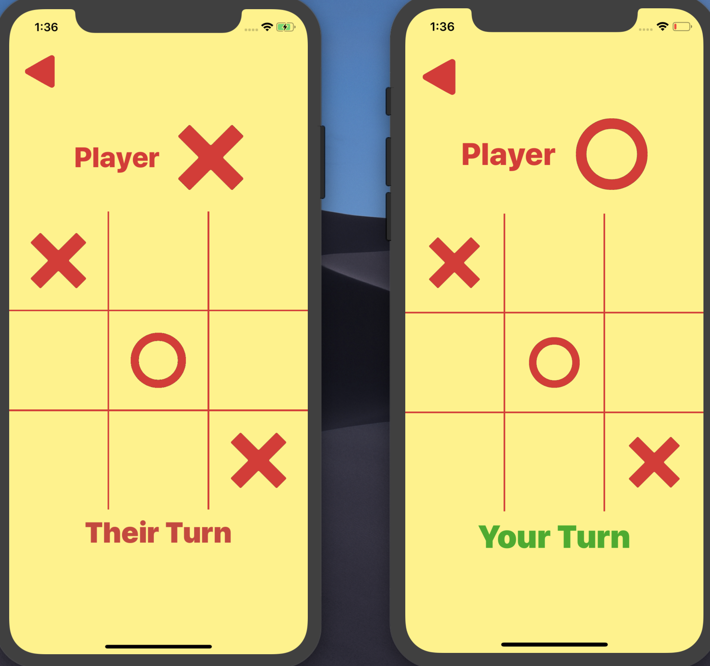

# TicTac2

### An iOS Tic Tac Toe game that lets two players simultaneously play the game using Multipeer Connectivity

## Features

### 1. Master/Slave Communication Protocol: 
Ensures that the connection is synchronized (handles connection latencies). 

#### Roles
* Master: The player who clicks play first becomes the master in the session
* Slave: The slave waits for the master to initialize the game, and then initializes the game.

#### Message Protocol
* "slave" : The master sends this message to the slave device once it initializes the game as a master. 
* "master" : The slave sends this message to the master device once it is done setting up the Game Screen.
* "X" / "O" : The master randomly decides its role as X/O, sets the UI accordingly, and then sends the "O"/"X" message to the slave. Once the slave receives this message, it initializes as "O"/"X" and sets the UI accordingly.
* "i" : Here, i is an integer in the range 0-8, which represents the index selected in the grid. Depending on who's turn it is, the master/slave sends this to the other device upon user interaction.

### 2. Uses Multipeer Connectivity for to create an easy-to-setup multiplayer game.

The game uses a zero-configuration protocol to instantly connect to nearby devices

## Future Improvements

1. Private Room Setup:

Currently, any two phones with the connection toggled ON can connect and play the game. However, in a room with multiple (2+) peers, it would be difficult to launch a game between just two phones. This problem can be solved by allowing a user to host a private room, so that another player can join it and play the game. 

2. More Messages: 

Currently, the Mutlipeer Messages are only enough to support the basic functionality of the game. However, in the future, I hope to integrate more messages into the system to detect unexpected failures on the master/slave's side and handle it appropriately. This will ensure that my game is much more robust and can handle any edge cases.

3. Add Landscape Support:

Currently, the game only supports the portrait orientation.

## Screenshots:

#### 1. Offline

     

#### 2. Connected

    

#### 3. Disconnected

    

#### 4. Game Play

    

#### 5. Game Initialization

    

#### 6. The End Game

    

